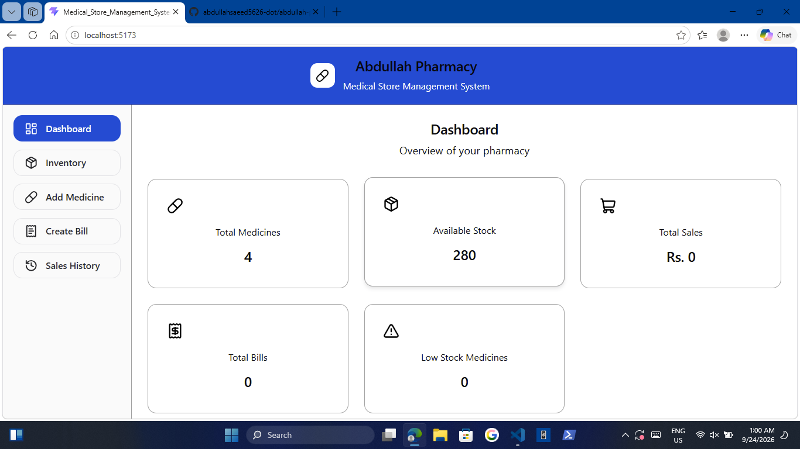
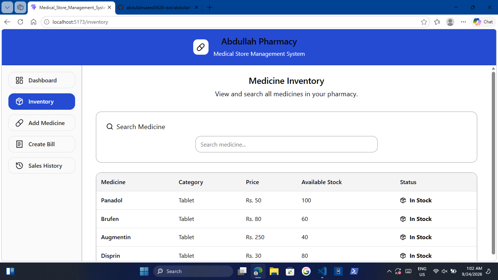
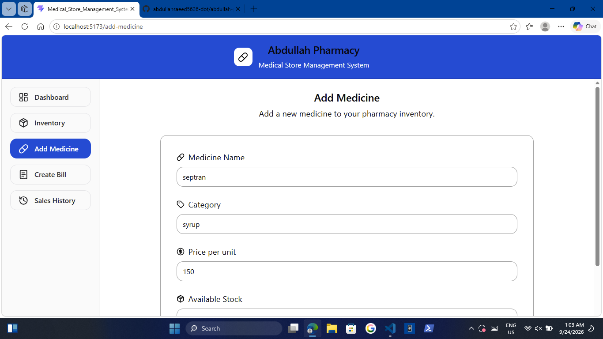
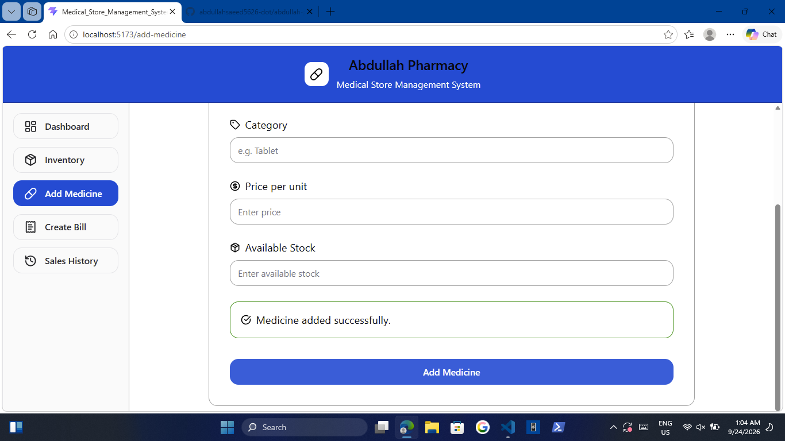
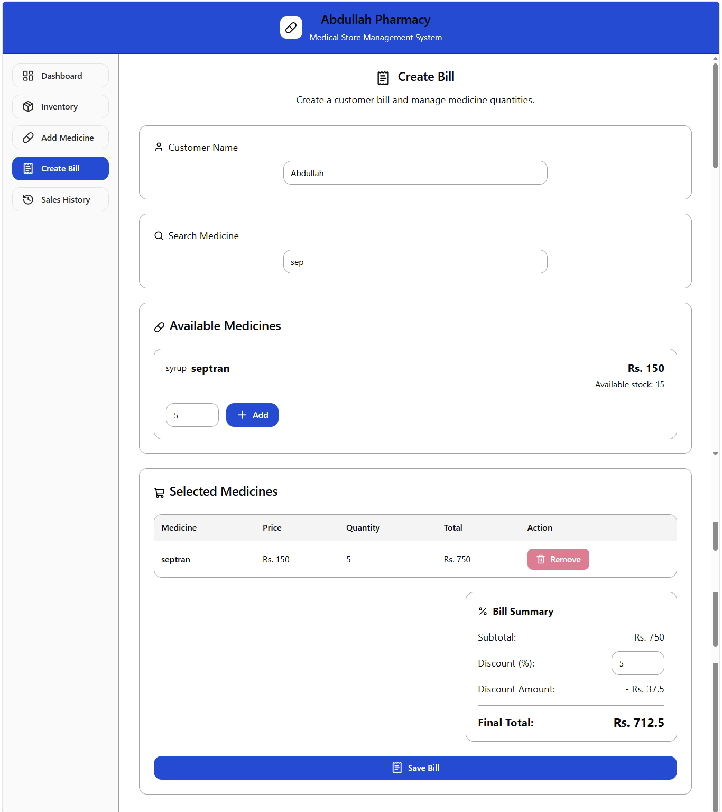
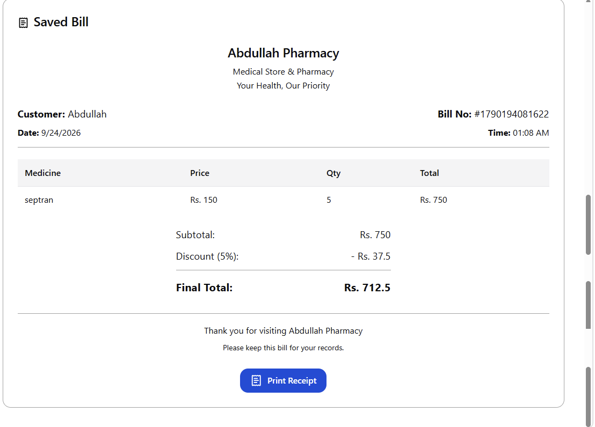
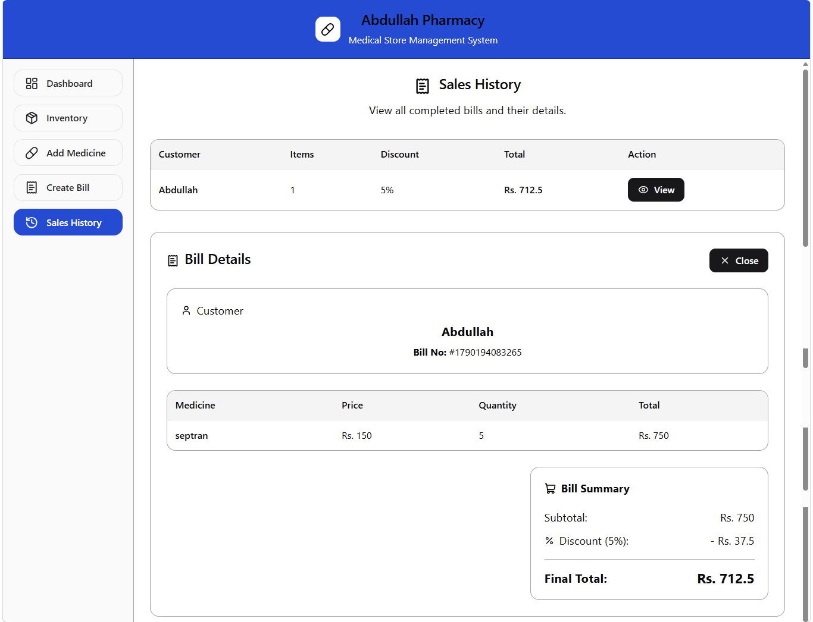
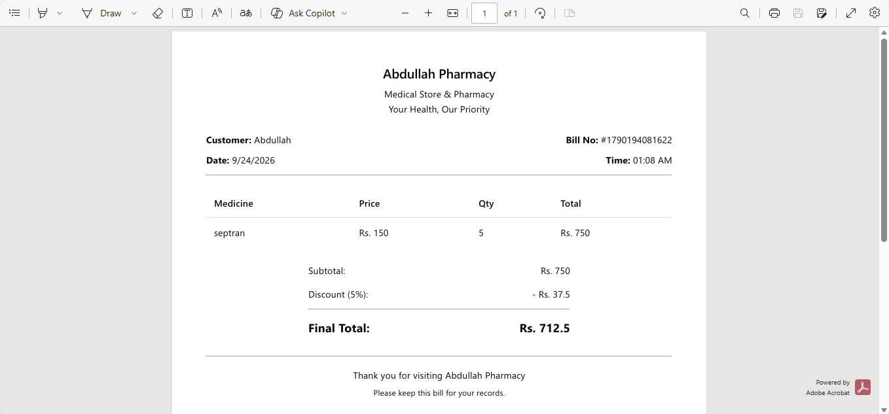

# 💊 Abdullah Pharmacy — Medical Store Management System

A modern **Medical Store Management System** built with **React, TypeScript, and Chakra UI**.

This project provides a frontend interface for managing medicines, inventory, customer billing, discounts, sales history, and printable receipts. It was developed as a practical React project to apply modern frontend development concepts in a real-world application.

> 🚧 **Project Status:** Frontend development in progress
> 💾 **Current Data:** React State + `medicines.json`
> 🔌 **Backend:** Planned for a future version

---

## 📸 Project Preview

### Dashboard



### Medicine Inventory



### Add Medicine



### Added Medicine



### Create Bill



### Saved Bill



### Sales History



### Customer Receipt



>

---

## ✨ Features

## 📊 Dashboard

- Overview of pharmacy inventory
- Quick access to major application sections
- Display of store-related information

## 💊 Inventory Management

- View available medicines
- Search medicines
- Display medicine prices
- Display available stock
- Track inventory quantities

## ➕ Add Medicine

- Add new medicines to inventory
- Enter medicine name
- Enter arriving quantity
- Enter price information
- Update the application inventory

## 🧾 Billing System

- Enter customer name
- Search for medicines
- Select one or multiple medicines
- Enter medicine quantities
- Display price per unit
- Calculate item totals automatically
- Calculate the complete bill total

## 💰 Discount System

- Apply percentage-based discounts
- Automatically calculate the discounted amount
- Display the final payable amount

## 📦 Automatic Stock Update

When a bill is saved, the application automatically deducts the sold quantity from the available medicine stock.

This keeps the inventory synchronized with the billing process during the current application session.

## 📜 Sales History

- View saved sales
- Open individual sale details
- View customer information
- View purchased medicines
- Review quantities and prices

## 🖨️ Printable Receipt

- Professional pharmacy receipt
- Customer information
- Medicine details
- Quantities
- Unit prices
- Item totals
- Discount
- Final amount
- Pharmacy name: **Abdullah Pharmacy**
- Dedicated print layout

## 🚫 404 Page

A dedicated page is provided for invalid or unavailable routes.

---

## 🛠️ Tech Stack

| Technology           | Usage                      |
| -------------------- | -------------------------- |
| ⚛️ React             | Frontend application       |
| 📘 TypeScript        | Type-safe development      |
| 🎨 Chakra UI         | User interface and styling |
| 🔄 React Context API | Shared application state   |
| 🪝 React Hooks       | State and component logic  |
| 🗃️ JSON              | Initial medicine data      |
| ⚡ Vite              | Development and build tool |

---

## 🧠 React Concepts Practiced

This project is also designed as a practical learning project for React.

Concepts implemented include:

- Functional Components
- JSX / TSX
- Props
- State Management
- `useState`
- `useContext`
- Context API
- Custom Hooks
- Event Handling
- Conditional Rendering
- Forms and User Input
- Array Methods
- Component Reusability
- Parent-Child Communication
- Shared State
- React Router
- Dynamic UI Updates

---

## 🏗️ Application Architecture

The current application follows a component-based React architecture.

```text
                    React Application
                           │
             ┌─────────────┴─────────────┐
             │                           │
       Store Context                React Router
             │                           │
       Shared State                Application Pages
             │                           │
     ┌───────┴────────┐          ┌───────┴────────┐
     │                │          │                │
 Medicines         Sales      Dashboard       Create Bill
     │                           │                │
 medicines.json             Inventory       Sales History
                                            │
                                      Printable Bill
```

---

## 📁 Project Structure

The project is organized into reusable sections:

```text
medical-store/
│
├── public/
│
├── src/
│   │
│   ├── assets/
│   │
│   ├── components/
│   │   └── ...
│   │
│   ├── pages/
│   │   ├── Dashboard.tsx
│   │   ├── Inventory.tsx
│   │   ├── AddMedicine.tsx
│   │   ├── CreateBill.tsx
│   │   ├── SalesHistory.tsx
│   │   ├── PrintableBill.tsx
│   │   └── NotFound.tsx
│   │
│   ├── context/
│   │   └── StoreContext.tsx
│   │
│   ├── hooks/
│   │   └── ...
│   │
│   ├── data/
│   │   └── medicines.json
│   │
│   ├── types/
│   │   └── ...
│   │
│   ├── App.tsx
│   └── main.tsx
│
├── package.json
├── vite.config.ts
├── tsconfig.json
└── README.md
```

> The structure may evolve as new functionality is added.

---

## 🔄 Current Data Flow

The current version uses frontend state rather than a backend database.

```text
medicines.json
      │
      ▼
React Application
      │
      ▼
StoreContext
      │
      ▼
Shared React State
      │
      ├── Inventory
      ├── Create Bill
      ├── Sales
      └── Dashboard
```

When a medicine is sold:

```text
Select Medicine
      ↓
Enter Quantity
      ↓
Add to Bill
      ↓
Calculate Total
      ↓
Apply Discount
      ↓
Save Bill
      ↓
Deduct Quantity from Stock
      ↓
Save Sale in Application State
```

---

## 🚀 Getting Started

## Prerequisites

Make sure you have installed:

- Node.js
- npm
- Git

## Installation

Clone the repository:

```bash
git clone <your-repository-url>
```

Move into the project directory:

```bash
cd medical-store
```

Install dependencies:

```bash
npm install
```

Start the development server:

```bash
npm run dev
```

Vite will provide a local development URL in the terminal.

---

## 🧪 Development

During development, the application can be tested by:

1. Adding medicines to inventory.
2. Searching for medicines.
3. Creating a customer bill.
4. Adding different medicine quantities.
5. Applying a discount.
6. Saving the bill.
7. Checking the updated stock.
8. Viewing the sale in Sales History.
9. Opening the saved receipt.
10. Printing the receipt.

---

## 🖨️ Receipt

The application includes a dedicated printable receipt for **Abdullah Pharmacy**.

Example structure:

```text
╔══════════════════════════════════╗
║         ABDULLAH PHARMACY        ║
╠══════════════════════════════════╣
║ Customer: Customer Name          ║
╠══════════════════════════════════╣
║ Medicine     Qty   Price   Total ║
║──────────────────────────────────║
║ Tablet A      2     100     200  ║
║ Tablet B      1     150     150  ║
╠══════════════════════════════════╣
║ Subtotal:                  350   ║
║ Discount:                  10%   ║
║──────────────────────────────────║
║ Final Total:              315    ║
╚══════════════════════════════════╝
```

The application uses a dedicated print layout so that the receipt can be printed independently from the main application interface.

---

## 🎯 Project Objectives

The main objectives of this project are to:

- Build a practical real-world React application.
- Develop a reusable component structure.
- Practice React state management.
- Understand and implement Context API.
- Work with forms and user input.
- Implement inventory calculations.
- Build a complete billing workflow.
- Manage application data between different pages.
- Create a professional printable receipt.
- Develop a portfolio-ready frontend project.

---

## 🔮 Future Roadmap

The current version focuses on the frontend. Future versions can introduce:

## Backend

- REST API
- Server-side data management
- Database integration
- Persistent medicine records
- Persistent sales records

## Authentication

- User login
- Admin account
- Staff accounts
- Role-based permissions

## Inventory

- Medicine categories
- Expiry-date tracking
- Low-stock alerts
- Supplier management
- Purchase records
- Stock-in / stock-out history

## Sales

- Invoice numbers
- Date-based sales filtering
- Sales reports
- Customer purchase history
- Daily/monthly revenue reports

## Storage

- Persistent database storage
- LocalStorage during an intermediate frontend stage
- Cloud/database deployment

## Deployment

- Production build
- Hosting
- Custom domain
- Backend deployment
- Database hosting

---

## 📈 Project Development Stages

Stage 1
React Fundamentals
↓
Stage 2
Medical Store UI
↓
Stage 3
Inventory Management
↓
Stage 4
Billing System
↓
Stage 5
Sales History
↓
Stage 6
Printable Receipt
↓
Stage 7
Persistent Storage
↓
Stage 8
Backend + Database
↓
Stage 9
Authentication
↓
Stage 10
Production Deployment

````

**Current focus:** Frontend functionality and UI refinement.

---

## 💡 Why This Project?

Medical stores involve several interconnected operations such as inventory management, billing, stock updates, and sales records.

Building this application provides practical experience in handling those relationships inside a React application instead of creating isolated demo components.

For example:

```text
Inventory
    ↕
Billing
    ↕
Stock
    ↕
Sales History
    ↕
Receipt
````

This makes the project a practical demonstration of frontend application architecture and state management.

---

## 👨‍💻 Author

## Abdullah Saeed

Frontend Developer / React Learner

This project is part of my practical journey toward building real-world React applications and developing a professional frontend portfolio.

---

## 📄 License

This project is created for **educational, learning, and portfolio purposes**.
